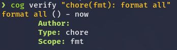

# Cocogitto

 
*Please if you are a graphic designer, help me with the logo*

Cocogitto is a set of cli tool for the [conventional commit](https://www.conventionalcommits.org/en/v1.0.0/) 
and [semver](https://semver.org/) specifications.  

## Foreword

There are plenty of tools listed on the [conventional commit web site](https://www.conventionalcommits.org/en/v1.0.0/#tooling-for-conventional-commits) 
to help you generate changelog, git hooks, commit template etc,
Some of them are specifically designed for the conventional commit specification and some of them are general purpose.
Cocogitto was designed to help you respect the conventional and semver standard and is not intended to be use in any other context.  

It strive to be a simple, modern and fast command line interface and leverage [git2-rs](https://github.com/rust-lang/git2-rs)
to provide what you would expect from such tool plus some original features.

## Table of contents
- [Configuration](#Configuration)
- [Commands list](#Commands-list)
- [Installation](#Installation)
- [Features](#Features)
    - [Creating conventional commits](#Creating-conventional-commits)
    - [Adding custom commit types](#Adding-custom-commit-types)
    - [Checking a repository](#Checking-a-repository)
    - [Interactive rebase](#Interactive-rebase)
    - [Verifying raw messages](#Verifying-raw-messages)
    - [Cog log](#Cog-log)
    - [Generating changelogs](#Generating-changelogs)
        - [To stdout](#To-stdout)
        - [To CHANGELOG.md](#To-CHANGELOG.md)
    - [Installing commit hooks](#Installing-commit-hooks)
- [Contributing](#Contributing)
- [Licence](#Licence)


## Configuration

*Comming soon**

## Command list 

*Comming soon**

## Installation

*Comming soon*

## Features 

Cocogitto command line interface (`cog`) is composed of a set of subcommands, to know more about one run 
`cog {subcommand} --help`. 
 
### Creating conventional commits

Conventional commits are structured as follow : 

```
<type>[optional scope]: <description>

[optional body]

[optional footer(s)]
```

By default `cog` allow you to create commit of the following types :

| Commit type                   | Subcommand        |
|:---                           | :---              |
| Feature                       | `cog feat`        | 
| Bug fix                       | `cog fix`         | 
| Chore                         | `cog chore`       |
| Revert                        | `cog revert`      |
| Performances                  | `cog perf`        |
| Documentation                 | `cog docs`        |
| Style                         | `cog style`       |
| Refactoring                   | `cog refactor`    |
| Test                          | `cog test`        |
| Build                         | `cog build`       |
| Continuous integration        | `cog ci`          |


To create a conventional commit use `git add` as you would normaly do. You can then create the commit with the desired commit type subcommand.

```shell script
cog {type} {scope} {message} {body} {footer}
```

As described in the specification, `scope`, `body` and `footer` are optional. A minimal commit
would look like this : 

```shell script
cog feat "add operator overloading"
```

This would produce a commit with the following message: `feat: add operator overloading`

**Note:** For the sake of conciseness and productivity, commit commands have not been grouped under a `commit` subcommand and commit args are positional only.


### Adding custom commit types

*Comming soon*


### Checking a repository

Before generating changelog and creating automatic version you might want to check that 
your git logs repect the conventional commit specification : 

```shell script
cog check
```

 

*Ouput example from [toml-bombadil](https://github.com/oknozor/toml-bombadil) project*


### Interactive rebase

Once you have spotted malformed commit message you can directly edit them :

```shell script
cog check --edit
```

[](https://asciinema.org/a/lv5c6SeB2J6MWioafh12EriAZ)

Here instead of just displaying errors, cocogitto will open invalid commit messages with `$EDITOR` and let you edit them to match the specification. Once done save the new message and edit the next errored one. 

Cocogitto will then perform a git rebase to rewrite edited commit messages. It is recommended to use `git push --force-with-lease` to synchronize your changes with your upstream branch.


### Verifying raw messages

You can check the validity of an arbitraty input string against the specification with `cog verify {message}` :



This is primarily used to create pre-commit hook. 

### Cog log

`cog log` is a git log tailored for the conventional commit specification : 

[](https://asciinema.org/a/ssH4yRSlc28Rb9dHEDN7TowGe)

Note that errored commit will still be displayed in the commit log. 

Additionally `cog log` allow you to filter the commit log based on `scope`, `type`, `author` and `date-range` (**Not yet implemented**)


### Generating changelogs

Cocogitto allow two main way to generate markdown changelogs : to stdout with the `changelog` command or to your `CHANGELOG.md` file with the `bump` command. 


#### To stdout

To generate a changelog directly to stdout simply run `cog changelog`. 
By default the commit range picked for the changelog is `latest_tag...HEAD`, if your repo contains no tag the initial commit will be picked instead. 

You can also manually specify the desired commit range with the `--from` and `--to` args. 
Both args accepts git commit id or tag name : 

```shell script
cog changelog --from 1.0.0 --to dc080dd06bccb3f4c665db1f71bfd119b7de85c3
```

[](https://asciinema.org/a/Eo46grfVXMONRerGuep1ftWQX)

#### To CHANGELOG.md

Instead of generating the changelog to stdout you can completely automate the version creation process with `cog bump`. 
This command does the following : 

- run pre-version hooks defined in your coco.toml config (ex: `cargo bump %version`)
- generate a changelog from latest tag to HEAD
- append the changelog to `CHANGELOG.md` (or the custom file defined in `coco.toml`)
- add unstaged changes to git index
- optionally create a tagged commit of the form `chore(version): bump to %version` (or the version commit template defined in the config)

The generated changelog will be appended on top of the previous version changelog, changelog header and footer will remain unchanged. 

To choose your next version scheme, `cog bump` comes with several flags : 
| flag          | description |
|:--            | :---        |
| `--auto`      | Automatically select the next version, and prompt the user for confirmation |
| `--manual`    | Select the next version from user input (ex: `cog bump 1.0.1`)              |
| `--major`     | Increase minor version (ex: `cog bump --minor`, bump from `1.0.0` to `1.0.1`)
| `--patch`     | Increase patch version (ex: `cog bump --patch`, bump from `1.0.1` to `1.1.0`)
| `--minor`     | Increase minor version (ex: `cog bump --minor`, bump from `1.1.0` to `2.0.0`)


### Installing commit hooks

If you want to enforce the conventional commit spec, it might be a good idea to set up a [pre-commit-hook](https://git-scm.com/book/en/v2/Customizing-Git-Git-Hooks).
`cog install hooks` will install a pre-commit hook that use the `cog verify` command whenever a new commit is created. 

⚠️  Be aware that by installing the pre commit hook, you will force your team to use cocogitto. ⚠️ 

## Contributing

Found a bug, have a suggestion for a new feature ? Please read the contribution guideline and submit an issue.

## Licence

All the code in this repository is released under the MIT License, for more information take a look at the [LICENSE](LICENSE) file.
