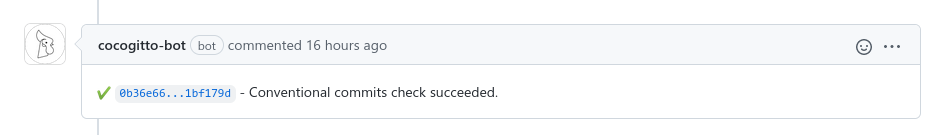

<p align="center">
  
</p>

<p align="center">
  <a href="https://github.com/cocogitto/cocogitto/actions"
    ></a>
  <a href="https://codecov.io/gh/cocogitto/cocogitto"
    ></a>
  <br />
  <a href="https://conventionalcommits.org"
    ></a>
  <a href="https://github.com/cocogitto/cocogitto/blob/main/LICENSE"
    ></a>
  <a href="https://discord.gg/WeZRdhtuf6">
    
  </a>

</p>

<p align="center">
  <a href="https://docs.cocogitto.io">Website</a>
  ·
  <a href="#installation">Installation</a>
  ·
  <a href="https://docs.cocogitto.io/config">Configuration</a>
</p>

<h1></h1>

**The Conventional Commits toolbox**

- **Verified commits:** create conventional compliant commits with ease.
- **Automatic Version bump and changelog:** automatically bump versions and generate changelogs with your own custom steps
  and workflows.
- **Release profiles:** your branching model requires different steps for releases, pre-release, hotfixes ? We got you
  covered !
- **Depends only on libgit2:** cocogitto has one standalone binary, the only system dependency is libgit2.
- **Conventional git log:** search your commit history matching Conventional Commits items such as scope and commit type.
- **GitHub integration:** enforce the conventional commits specification with our GitHub action and bot.
- **Monorepo support:** Automatic versioning for mono-repositories is supported out of the box.

<p align="center">
<a href="https://docs.cocogitto.io/"><strong>Explore Cocogitto's docs&nbsp;&nbsp;▶</strong></a>
</p>

## Foreword

### What is it ?

Cocogitto is a CLI and GitOps toolbox for the [Conventional Commits](https://www.conventionalcommits.org/en/v1.0.0/)
and [Semver](https://semver.org/) specifications.

### Why ?

There are plenty of tools listed on
the [conventional commits website](https://www.conventionalcommits.org/en/about/)
to help you generate changelog, git hooks, commit template etc. Some of them are specifically designed for the
Conventional Commits specification, and some of them are general purpose. 

**Cocogitto was designed to help you respect the
conventional and semver standard and is not intended to be used in any other context.**

It strives to be a set of simple, modern and fast command line interfaces.

### Goals

- Make using the conventional commits spec easy and fun.
- Enable people to focus on their work instead of correcting small mistakes and typos.
- Enforce correctness regarding Semver and Conventional Commits.
- Automate things when possible (ex: bumping versions).

### Non goals

- Cocogitto is not a `git` replacement. It uses some of libgit2 but only to provide features related to the
  Conventional Commits specification. Anything else shall be done with `git`.
- Supporting other commit conventions or git workflows.

## Quick start

This readme is a quick tour of what you can do with Cocogitto, for an in-depth guide please refer
to [the documentation](https://docs.cocogitto.io).

## Installation

[](https://repology.org/project/cocogitto/versions)

#### Archlinux

```shell
pacman -S cocogitto
```

#### Cargo

```shell
cargo install --locked cocogitto
```

#### NixOs

```shell
nix-env -iA cocogitto
```

#### Void Linux

```shell
xbps-install cocogitto
```

#### MacOS

```shell
brew install cocogitto
```

## Conventional commits

To create conventional commits you can use the `cog commit` command.
It has subcommands for the default `fix` and `feat` Conventional Commits types
plus the [angular commit](https://github.com/angular/angular/blob/22b96b9/CONTRIBUTING.md#-commit-message-guidelines)
conventional commit types.

**Example:**

```shell
# With cog
cog commit feat "add awesome feature"

# With git
git commit -m "feat: add awesome feature"
```

See [User guide -> Conventional commits](https://docs.cocogitto.io/guide/commit#conventional-commits).

## Configuration

Use `cog.toml` file to configure your usage of Cocogitto.

For the full list of options, see [User guide ->  Configuration reference](https://docs.cocogitto.io/reference/config#configuration-reference).

## Auto-bumps

Creating a version with `cog bump` will perform the following actions :

1. Determine a version number according to your commit history.
2. Perform configuration defined pre-bump commands.
3. Append the version's changelog to your repository changelog file.
4. Create a version commit and tag it.
5. Perform post-bump commands

**Example:**

```shell
# File: cog.toml
pre_bump_hooks = [
    "echo {{version}}",
]


post_bump_hooks = [
    "git push",
    "git push origin {{version}}",
]

[changelog]
path = "CHANGELOG.md"
template = "remote"
remote = "github.com"
repository = "cocogitto_bot_playground"
owner = "cocogitto"
authors = [
  { username = "oknozor", signature = "Paul Delafosse"}
]
```


## Changelogs

`cog changelog` uses [tera](https://keats.github.io/tera/) templates to generate markdown changelogs. It has several built-in
templates, and you can define your own.

**Example:**

```shell
cog changelog
```

Output :

```markdown
## 1.2.0 - 2021-11-26

#### Bug Fixes

- **(parser)** handle lowercase identifier - (7521015) - *oknozor*
- handle unknown flag - (e2388dc) - oknozor

#### Features

- **(parser)** simple parser implementation - (0b25eb6) - *oknozor*
- add a new cli flag - (ff84173) - oknozor

#### Miscellaneous Chores

- **(version)** 1.2.0 - (15d1333) - *oknozor*

#### Refactoring

- **(parser)** use a parser interface instead of concrete impl - (ea24c36) - *oknozor*

#### Tests

- add integration test - (bae629c) - *oknozor*
```

See [User guide -> Changelogs](https://docs.cocogitto.io/guide/#changelogs).

## Docker

There is a docker image for `cog` available [ghcr.io/cocogitto/latest](https://github.com/cocogitto/cocogitto/pkgs/container/cog).

**Usage:**

```shell
docker pull ghcr.io/cocogitto/cog:latest
docker run -t -v "$(pwd)":/app/ check
```

Note that you need to mount a volume pointing to your target directory for `cog` to be able to operate on your git log.

See [Docker ->  Using cocogitto with docker](./docker/#Using-cocogitto-with-docker).

## GitHub integration

**GitHub action:**

You can run cog check and perform automatic releases via GitHub action
using [cocogitto-action](https://github.com/cocogitto/cocogitto-action).

**Example:**
```yaml
  - name: Semver release
    uses: cocogitto/cocogitto-action@main
    with:
      release: true
      git-user: 'Cog Bot'
      git-user-email: 'mycoolproject@org.org'
```

See [Github integration -> GitHub action](https://docs.cocogitto.io/ci_cd/action#github-action)

**GitHub bot:**

[cocogitto-bot](https://github.com/apps/cocogitto-bot) is a standalone, zero-config bot checking your pull requests
against the Conventional Commits specification.



See [Github integration -> GitHub-bot](https://docs.cocogitto.io/ci_cd/#github-bot)

## Similar projects 

- [git-cliff](https://github.com/orhun/git-cliff)
- [convco](https://github.com/convco/convco)
- [koji](https://github.com/its-danny/koji)
- [semantic-release](https://semantic-release.gitbook.io)
- [commitlint](https://github.com/conventional-changelog/commitlint)
- [cargo-smart-release](https://github.com/byron/gitoxide/tree/a1c68da4b0fa080a383cbbfa50fd54e8bb45330c/cargo-smart-release)

## Contributing

Found a bug, have a suggestion for a new feature? Please read the [contribution guideline](CONTRIBUTING.md) and [submit an issue](https://github.com/cocogitto/cocogitto/issues/new/choose).

## Licence

All the code in this repository is released under the MIT License, for more information take a look at
the [LICENSE](LICENSE) file.
