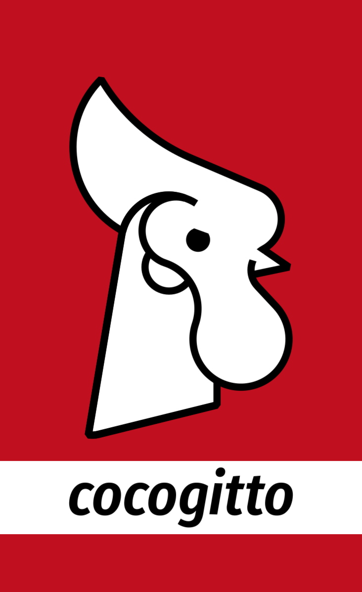

# Cocogitto visual

The above logos where designed by Arnaud Perrot <arn.perrot@gmail.com> a friend and opensource
enthusiast graphic designer. 

    

    

    Logo squared

    

    Rounded text logo

    

    Rounded logo

