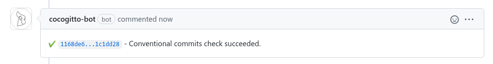
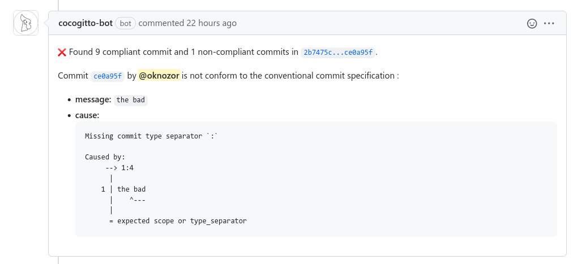

# GitHub Bot

Cocogitto also has a GitHub bot that decorates pull request with status check.

To install it just go to [github.com/apps/cocogitto-bot](https://github.com/apps/cocogitto-bot) and click "Configure".
Add the desired repository and grant the required permission.

Once it is done cocogitto-bot will comment on every pull-request events :

**Example:**

Success:

Failure:

::: tip
You can [make status check mandatory](https://docs.github.com/en/repositories/configuring-branches-and-merges-in-your-repository/defining-the-mergeability-of-pull-requests/troubleshooting-required-status-checks) to enforce conventional commits in your pull-requests.
:::